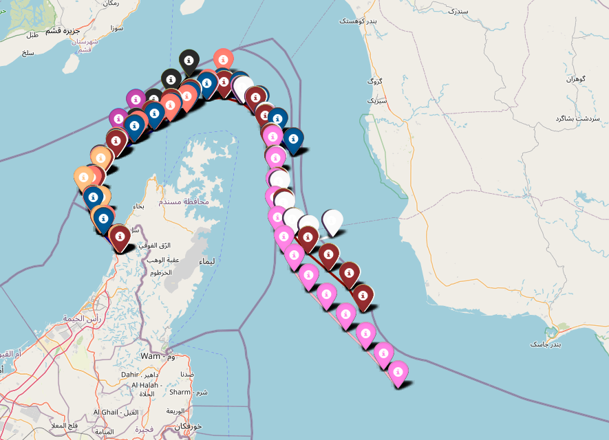

# sgbs210

## In the scripts folder
- unique_ships.py tell us that there are 904 unique ships.
- ships_basic.py reads in json and outputs a more manageable version of the data in data_james/ships_basic. One file per ship.
- ships_detailed.py reads in the text files from data_james/ships_basic and outputs an even more accessible version in data_james/ships_detailed. Also one file per ship.
- plot.py takes in a file from data_james/ships_basic and makes a plot for that ship. Something like this:
